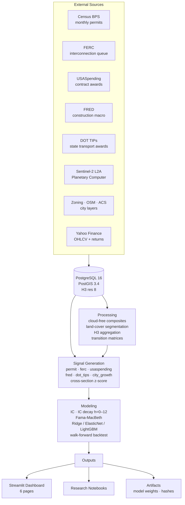

# Urban Growth Research Platform

Construction and infrastructure alt-data signal research platform.
Predicts monthly cross-sectional equity returns for a ~50-stock universe using
national construction/infrastructure data combined with satellite-derived urban
growth signals for Phoenix and Austin.

## Hypothesis

> **Cities growing faster than the market expects — measured from space —
> are more profitable operating environments for homebuilders, materials
> suppliers, and infrastructure contractors than national macro data alone
> captures.** Combining permit flow, interconnection-queue build-out,
> federal contract awards, and satellite-derived built-area expansion
> produces signal IC above 0.04 at h=1–3 months after controlling for
> price momentum and volume.

---

## Architecture



---

## Requirements

### Hardware

| Component | Minimum | Recommended |
|-----------|---------|-------------|
| GPU | NVIDIA RTX 3060 (CUDA 11.7+) | RTX 5070 (Blackwell, CUDA 12.8) |
| RAM | 16 GB | 32 GB |
| Storage | 200 GB free | 1 TB SSD (satellite imagery) |
| OS | Windows 11 / Ubuntu 22.04 | Windows 11 |

### Software prerequisites

| Dependency | Version | Install |
|-----------|---------|---------|
| Miniconda / Anaconda | ≥ 23.x | [conda.io](https://docs.conda.io/en/latest/miniconda.html) |
| PostgreSQL | 16.x | [enterprisedb.com](https://www.enterprisedb.com/downloads/postgres-postgresql-downloads) |
| PostGIS | 3.4 | Stack Builder → Spatial Extensions |
| Git | ≥ 2.40 | [git-scm.com](https://git-scm.com) |
| CUDA Toolkit | 12.8 | [nvidia.com/cuda](https://developer.nvidia.com/cuda-downloads) (RTX 5070) |

---

## Quick start

```powershell
# 1. Clone
git clone https://github.com/yourname/urbangrowth
cd urbangrowth

# 2. Create conda environment (≈ 5 min)
conda env create -f environment.yml
conda activate urbangrowth

# 3. Install PyTorch with CUDA 12.8 (RTX 5070 / Blackwell sm_120)
pip install --pre torch torchvision --index-url https://download.pytorch.org/whl/nightly/cu128

# 4. Editable install
pip install -e .

# 5. Create data root
New-Item -ItemType Directory -Force -Path C:\urbangrowth_data

# 6. Configure environment variables
Copy-Item .env.example .env
# Edit .env: add CENSUS_API_KEY, FRED_API_KEY, POSTGRES_PASSWORD

# 7. Initialise PostgreSQL
.\scripts\01_init_postgis.ps1

# 8. Verify the stack
ug doctor

# 9. Ingest data (can run overnight)
ug ingest markets --start 2015-01-01
ug ingest census-bps --start 2015-01
ug ingest ferc-queue
ug ingest usaspending --start 2015-01
ug ingest fred
ug ingest dot-tips --states TX,CA,AZ

# 10. Satellite pipeline (Phoenix)
ug composite generate --city phoenix --start 2018-01 --end 2025-12
ug segment run --city phoenix
ug process h3 --city phoenix --start 2018-01 --end 2025-12
ug process change --city phoenix --start 2018-01 --end 2025-12
ug features build --city phoenix --start 2018-01 --end 2025-12

# 11. Build signals
ug signals build --start 2015-01 --end 2025-12

# 12. Validate
ug model ic-test --signal all
ug model decay --signal all
ug model cross-section --horizon 1

# 13. Fit + backtest
ug model fit --model ridge --horizon 1
ug model backtest --model ridge --horizon 1

# 14. Launch dashboard
streamlit run dashboards/streamlit_app.py
```

**Reproduce the paper results on a short sample:**
```bash
make reproduce      # runs 2022-01 → 2022-06 end-to-end
```

---

## Data inventory

| Source | Layer | License | Refresh | Notes |
|--------|-------|---------|---------|-------|
| US Census Bureau | Building Permits Survey (BPS) — national + MSA | Public domain | Monthly (~6-week lag) | Res + commercial units, value |
| FERC | Interconnection queue snapshots | Public domain | ~Weekly | Project-level MW, fuel, ISO, status |
| USASpending.gov | Federal construction contract awards | Public domain | Daily | NAICS-filtered; 2383, 2370, 2371 |
| FRED (St. Louis Fed) | TLNRESCONS, PRRESCONS, MORTGAGE30US, T10Y2Y | Public domain | Monthly / weekly | 20 series; see `config/fred_series.yaml` |
| State DOTs | Transportation Improvement Programs (TX, CA, AZ) | Public domain | Quarterly | Scraped; unstable format |
| USGS 3DEP | Digital Elevation Model (1/3 arc-second) | Public domain | Static | Used for terrain masking |
| ESA Copernicus | Sentinel-2 L2A (10 m) via Planetary Computer | CC BY-SA 3.0 IGO | ~5 days | Cloud-masked monthly medians |
| OpenStreetMap | Building footprints, road network | ODbL | Continuous | Used for zoning alignment |
| Yahoo Finance | Daily OHLCV + adjusted returns | Non-commercial, delayed | Daily | Universe + SPY / XHB / PAVE benchmarks |
| City of Phoenix / Austin | Building permits, parcel CAMA, zoning | Public domain / CC0 | Varies | Used to validate satellite signals |

> **License note:** Sentinel-2 data requires attribution. All other sources are
> in the public domain or under open licenses compatible with research use.
> Yahoo Finance data must not be used for commercial redistribution.

---

## Environment variables

| Variable | Required | Example |
|----------|----------|---------|
| `CENSUS_API_KEY` | Yes | `api.census.gov` key |
| `FRED_API_KEY` | Yes | `fred.stlouisfed.org` key |
| `POSTGRES_HOST` | No | `localhost` |
| `POSTGRES_PORT` | No | `5432` |
| `POSTGRES_DB` | No | `urbangrowth` |
| `POSTGRES_USER` | No | `urbangrowth` |
| `POSTGRES_PASSWORD` | Yes | your password |
| `URBANGROWTH_DATA_ROOT` | Yes | `C:/urbangrowth_data` |
| `POSTGRES_TEST_URL` | For tests | `postgresql+psycopg2://...urbangrowth_test` |

---

## Project layout

```
urbangrowth/
├── config/                   # YAML configs (universe, cities, pipeline, FRED series)
│   ├── universe.yaml         # ~50-stock universe with sector, geographic_concentration
│   ├── pipeline.yaml         # data root, subdirectory layout
│   ├── cities.yaml           # bounding boxes, H3 resolution per city
│   └── fred_series.yaml      # FRED series IDs and their sector applicability
│
├── src/urbangrowth/
│   ├── config.py             # Config loader (get_universe, get_pipeline, data_path)
│   ├── data/                 # One module per external data source
│   │   ├── census_bps.py     # Census BPS ingestion
│   │   ├── ferc_queue.py     # FERC queue ingestion
│   │   ├── usaspending.py    # USASpending awards
│   │   ├── fred.py           # FRED macro series
│   │   ├── dot_tips.py       # State DOT TIPs scraper
│   │   ├── markets.py        # Yahoo Finance OHLCV + returns
│   │   └── ...               # Sentinel-2, zoning, parcels, OSM
│   │
│   ├── processing/
│   │   ├── composites.py     # Cloud-free Sentinel-2 monthly composites
│   │   ├── segmentation.py   # DynamicWorld / Prithvi land-cover inference
│   │   ├── h3_aggregate.py   # Raster → H3 hex grid aggregation
│   │   ├── change.py         # Monthly land-cover transition matrices
│   │   └── features.py       # H3 feature table assembly
│   │
│   ├── signals/
│   │   ├── permit_signals.py # Census BPS → per-ticker signals
│   │   ├── ferc_signals.py   # FERC queue → per-ticker signals
│   │   ├── usaspending_signals.py
│   │   ├── fred_signals.py
│   │   ├── dot_tips_signals.py
│   │   ├── city_growth_signals.py
│   │   ├── ticker_mapping.py # universe.yaml → signal applicability + geo weights
│   │   ├── utils.py          # zscore_cross_section, rolling_zscore, yoy_change
│   │   └── build.py          # Orchestrator: run all signal families
│   │
│   ├── modeling/
│   │   ├── _data.py          # Shared loaders (returns, fwd, momentum, volume, panel)
│   │   ├── ic_test.py        # Spearman IC, IC IR, NW t-stat, bootstrap CI, BH-FDR
│   │   ├── decay_test.py     # IC at horizons 0–12 months
│   │   ├── cross_section.py  # Fama-MacBeth + Ridge/ElasticNet/LightGBM walk-forward
│   │   ├── backtest.py       # L/S portfolio, TC model, FF factor exposure
│   │   ├── artifacts.py      # Save/load model weights + SHA-256 manifest
│   │   ├── lag_signals.py    # Granger causality / VAR (stub)
│   │   └── stats.py          # NW HAC, bootstrap CI, BH-FDR
│   │
│   ├── db/
│   │   ├── schema.py         # SQLAlchemy table definitions
│   │   └── loaders.py        # Engine factory, upsert_df
│   │
│   └── cli.py                # Typer entry point (ug ...)
│
├── dashboards/
│   ├── streamlit_app.py      # Landing page
│   ├── data.py               # Cached loaders
│   ├── components/           # pydeck + plotly helpers
│   └── pages/                # 6 named pages (auto-discovered by Streamlit)
│
├── notebooks/                # Phase-by-phase exploratory notebooks
├── tests/
│   ├── conftest.py           # Shared fixtures (synthetic data, DB session)
│   ├── unit/                 # Pure-function unit tests (no DB)
│   └── integration/          # End-to-end tests on synthetic data
│
├── docs/
│   └── paper_draft.md        # 8-page academic paper outline
│
├── scripts/
│   ├── 00_setup_env.ps1/sh   # Create conda env + PyTorch install
│   ├── 01_init_postgis.ps1/sh # PostgreSQL + PostGIS + schema
│   ├── 02_bootstrap_data.ps1  # First-run data ingest
│   └── reproduce.py           # Full pipeline on sampled date range
│
├── environment.yml            # Conda environment spec (minimum versions)
├── pyproject.toml             # Package metadata + entry points
└── Makefile                   # install · test · coverage · lint · reproduce
```

---

## CLI reference

```bash
ug doctor                                          # verify stack before anything

# Ingest
ug ingest markets --start 2015-01-01
ug ingest census-bps --start 2015-01
ug ingest ferc-queue
ug ingest usaspending --start 2015-01
ug ingest fred
ug ingest dot-tips --states TX,CA,AZ

# Satellite pipeline
ug composite generate --city phoenix --start 2018-01 --end 2025-12
ug segment run --city phoenix --model dynamic_world --device cuda
ug process h3 --city phoenix --start 2018-01 --end 2025-12
ug process change --city phoenix --start 2018-01 --end 2025-12
ug features build --city phoenix --start 2018-01 --end 2025-12

# Signals
ug signals build --start 2015-01 --end 2025-12   # all families
ug signals permit --start 2020-01 --end 2025-12   # individual family

# Modeling
ug model ic-test --signal all
ug model ic-test --signal permit --horizon 3
ug model decay --signal all
ug model cross-section --horizon 1               # Fama-MacBeth
ug model fit --model ridge --horizon 1           # walk-forward scores
ug model fit --model lgbm --horizon 1
ug model backtest --model ridge --horizon 1
```

---

## Phase status

| Phase | Description | Status |
|-------|-------------|--------|
| 0 | Project skeleton, configs, environment | ✅ Complete |
| 1–2 | National + city data ingestion (Census, FERC, USASpending, FRED, Sentinel-2) | ⬜ Run pipeline |
| 3 | Processing: composites, segmentation, H3 aggregation, change | ⬜ Run pipeline |
| 4 | Feature tables (H3 panel, signal_features) | ⬜ Run pipeline |
| 5–6 | Phoenix & Austin exploratory notebooks | ✅ Code complete |
| 7 | Phoenix H3 features notebook | ✅ Code complete |
| 8 | Signal store (all 6 families → signal_features) | ✅ Code complete |
| 9 | IC / decay / cross-section validation | ✅ Code complete |
| 10 | Walk-forward model + backtest | ✅ Code complete |
| 11 | Streamlit dashboard (6 pages) | ✅ Code complete |
| 12 | Reproducibility, tests, write-up | ✅ Code complete |

---

## Limitations

1. **Small universe (~50 stocks).** Each L/S quintile contains ≈10 names. Standard errors
   on Sharpe and annualised alpha are large — treat point estimates as directional
   rather than precise.

2. **Single market regime.** The 2015–2025 window spans one major dislocation (COVID-19)
   and a rate cycle, but not a multi-decade stress test. Out-of-sample validity is unproven.

3. **Satellite coverage limited to Phoenix and Austin.** City-growth signals are not
   available for most tickers; national proxies (permit density, FERC) fill the gap
   but with lower geographic specificity.

4. **Recipient-to-ticker mapping is incomplete.** USASpending subsidiaries and joint ventures
   are frequently missed. False negatives suppress signal strength for diversified
   engineering and construction firms.

5. **National signals produce synthetic cross-sectional variance.** Census BPS and FRED
   series are multiplied by sector sensitivity weights to create per-ticker dispersion.
   This dispersion is modeled, not observed.

6. **No execution model.** The 10 bps/side transaction cost is a point estimate.
   Actual market impact for concentrated positions in small-cap names may be 5–20×
   higher.

7. **FERC queue structural breaks.** PJM's 2022 queue reform and MISO cluster studies
   introduce level-shifts that are not flagged in the data. Queue vintages should be
   checked before extending history pre-2020.

8. **Endogeneity.** FRED construction spending and MORTGAGE30US are partially priced
   into equities by institutional macro strategies. The incremental IC over a
   market-implicit estimate is unknown without access to real-time vintage data.
